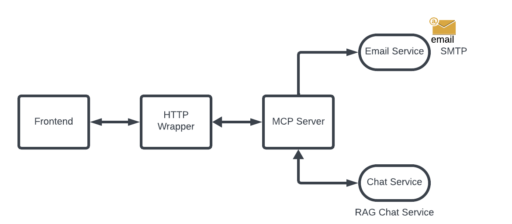
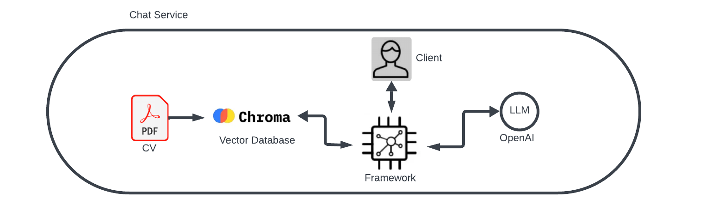

# RAG Service - PDF Question Answering System

A Python-based Retrieval Augmented Generation (RAG) system for PDF document analysis. This lightweight application allows users to upload PDF files through a web interface and provides an AI-powered question-answering interface through a REST API. It uses Groq's LLM API and HuggingFace embeddings to deliver accurate responses about document content.

## Features

- **PDF Upload**: Upload PDF documents directly through the web interface
- **Dynamic Processing**: Automatically processes uploaded PDFs for AI-powered analysis
- **Vector Storage**: Uses ChromaDB with HuggingFace embeddings for efficient semantic search
- **Groq Integration**: Leverages Groq's fast LLM API (Llama 3 70B) for high-quality responses
- **Memory Optimized**: Streamlined architecture using local embeddings
- **REST API**: Provides HTTP endpoints with CORS support for frontend integration
- **Docker Support**: Easy deployment with Docker

## Architecture

### System Overview



The system architecture consists of:

- **Frontend Interface**: Web-based client for user interactions and PDF uploads
- **Backend Server**: FastAPI HTTP server for RAG and upload functionality
- **Vector Database**: ChromaDB for efficient document storage and retrieval
- **Groq API**: For fast LLM inference
- **HuggingFace Embeddings**: For local document embeddings (no API key required)

### RAG Pipeline Overview



The Retrieval Augmented Generation (RAG) pipeline enhances the AI's responses by:

1. **Retrieval**: Finding relevant information from the CV database
2. **Augmentation**: Combining retrieved context with the user's question
3. **Generation**: Creating accurate, contextually relevant answers

### Component Details

1. **Document Processing**:
   - PDF parsing with PyPDF
   - Text chunking with RecursiveCharacterTextSplitter
   - Automatic file handling and metadata extraction

2. **Vector Storage**:
   - ChromaDB for efficient vector storage
   - OpenAI text-embedding-3-small model for embeddings
   - Semantic search capabilities

3. **RAG Implementation**:
   - Optimized single initialization of language models
   - Memory-efficient retrieval chain
   - Document context integration with LLM

4. **API Layer**:
   - FastAPI with Pydantic models
   - CORS middleware for frontend integration
   - Structured JSON responses

## Setup

### 1. Create a Virtual Environment

```bash
# For Windows
python -m venv .venv
.\.venv\Scripts\Activate.ps1  # For PowerShell
# OR
.\.venv\Scripts\activate.bat  # For Command Prompt

# For macOS/Linux
python3 -m venv .venv
source .venv/bin/activate
```

### 2. Install Dependencies

```bash
pip install -r requirements.txt
```

### 3. Environment Configuration

Create a `.env` file and configure your API keys:

```
GROQ_API_KEY=your_groq_api_key_here
GROQ_MODEL=llama3-70b-8192
CORS_ORIGINS=*  # Or specific origins separated by commas
```

### 3. Folder Structure

```
rag-service-backend/
├── Data/          # Place PDF documents here for processing
├── DB/            # Vector database storage (auto-created)
├── Uploads/       # Uploaded PDFs (auto-created)
├── ingest.py      # Document ingestion script
├── models.py      # Groq and HuggingFace model configurations
├── chat.py        # Interactive chat interface
├── app.py         # FastAPI server with RAG and upload endpoints
└── rag_core.py    # Core RAG implementation
```

## Quick Start Guide

### Running Locally

Follow these steps to run the project locally:

1. **Clone or navigate to the repository**

   ```bash
   cd Backend
   ```

2. **Set up a virtual environment**

   ```bash
   # For Windows PowerShell
   python -m venv .venv
   .\.venv\Scripts\Activate.ps1

   # For macOS/Linux
   python3 -m venv .venv
   source .venv/bin/activate
   ```

3. **Install dependencies**

   ```bash
   pip install -r requirements.txt
   ```

4. **Configure environment variables**
   - Create a `.env` file with your Groq API key

5. **Run the RAG service**

   ```bash
   python app.py
   ```

6. **Access the application**
   - Open your browser to: http://localhost:8000/docs for API documentation
   - Or run the frontend to use the web interface for uploading PDFs

## Usage

### Option 1: Web Interface (Recommended)

1. Start the backend server: `python app.py`
2. Start the frontend (see Frontend section)
3. Upload a PDF document through the web interface
4. Ask questions about the uploaded document

### Option 2: Manual PDF Ingestion

```bash
python ingest.py
```

This will:

1. Process any PDF files in the `./Data` folder
2. Convert text into semantically meaningful chunks
3. Generate embeddings using HuggingFace's local model
4. Store vectors in the ChromaDB vector database
5. Mark processed files with a `_` prefix to avoid reprocessing

### Running the RAG Service

```bash
python app.py
```

This will:

1. Initialize the RAG system with optimized memory usage
2. Start the FastAPI server on port 8000 (configurable via PORT env variable)
3. Make the RAG endpoint available via HTTP

### Interactive Chat Interface

For local testing without a frontend:

```bash
python chat.py
```

### Querying via REST API

Make POST requests to the RAG endpoint:

```bash
curl -X POST "http://localhost:8000/tools/rag" \
     -H "Content-Type: application/json" \
     -d '{"question": "What are my technical skills?"}'
```

Response:

```json
{
  "question": "What are my technical skills?",
  "answer": "Based on your CV, your technical skills include Python, JavaScript, FastAPI, React, Docker, AWS, and data analysis...",
  "timestamp": "2025-09-04 15:22:33",
  "status": "success"
}
```

## Deployment

### Docker Deployment

Build and run with Docker:

```bash
# Build the image
docker build -t rag-service .

# Run with environment variables
docker run -p 8000:8000 \
  -e GROQ_API_KEY=your_key \
  -e GROQ_MODEL=llama3-70b-8192 \
  rag-service
```

### Deploying to Render

1. Push your repository to GitHub
2. Create a new Web Service on Render
3. Connect your GitHub repository
4. Configure as follows:
   - Environment: Docker
   - Environment Variables:
     - `GROQ_API_KEY`: Your Groq API key
     - `GROQ_MODEL`: Model to use (e.g., llama3-70b-8192)
     - `CORS_ORIGINS`: Allowed origins (e.g., your frontend URL)

#### Live Deployment

This project is currently deployed and accessible at:

**[https://cv-rag-system.onrender.com](https://cv-rag-system.onrender.com)**

You can:

- Test the RAG endpoint at `https://cv-rag-system.onrender.com/tools/rag`
- View API documentation at `https://cv-rag-system.onrender.com/docs`
- Check system health at `https://cv-rag-system.onrender.com/health`

## API Reference

### Upload PDF Endpoint

```
POST /upload
```

Request (multipart/form-data):

- `file`: PDF file to upload

Response:

```json
{
  "filename": "string",
  "status": "success",
  "message": "string",
  "chunks_created": number
}
```

### RAG Endpoint

```
POST /tools/rag
```

Request:

```json
{
  "question": "string" // Question about the CV content
}
```

Response:

```json
{
  "question": "string", // Original question
  "answer": "string", // AI-generated answer based on CV
  "timestamp": "string", // ISO format timestamp
  "status": "success" // Status of the request
}
```

### Health Check

```
GET /health
```

Response:

```json
{
  "status": "healthy",
  "service": "RAG Service"
}
```

## Configuration

### CORS Configuration

Configure CORS in your `.env` file:

```
# Allow all origins
CORS_ORIGINS=*

# Allow specific origins
CORS_ORIGINS=https://your-frontend.com,https://another-app.com
```

### Model Configuration

The system is configured to use:

- **Embeddings**: sentence-transformers/all-MiniLM-L6-v2 (via HuggingFace Inference API, requires free HF_TOKEN)
- **Language Model**: Groq Llama 3 70B (fast, high-quality inference)

## Technical Details

### Dependencies

Current essential dependencies:

- `python-dotenv`: Environment variable management
- `langchain`: RAG framework
- `langchain-community`: Document loaders & Embeddings
- `langchain-chroma`: Vector database integration
- `langchain-groq`: Groq API integration
- `pypdf`: PDF processing
- `fastapi`: REST API framework
- `uvicorn`: ASGI server
- `python-multipart`: File upload support

### Memory Optimization

The system has been optimized for minimal memory usage:

- Uses local HuggingFace embeddings (no API calls, faster processing)
- Groq API for LLM inference (no local model loading required)
- Single initialization pattern for models
- Streamlined retrieval chain
- Efficient vector storage with ChromaDB

### Performance Considerations

- Initial request may take 1-3 seconds for RAG system initialization
- Subsequent requests are faster (~0.5-1.5 seconds)
- Vector database search is optimized for top-10 results
- Document chunks are sized for optimal retrieval (1000 characters with 50 overlap)

## Troubleshooting

### API Key Issues

If you encounter authentication errors:

- Verify your Groq API key is correct and has sufficient quota
- Check that the API key is properly set in your `.env` file
- Get your free Groq API key from https://console.groq.com/

### Deployment Issues

For Render deployment problems:

- Ensure all environment variables are correctly set in Render dashboard
- Check if your repository is properly connected
- Verify Docker build is successful

## Contributing

Contributions are welcome! Please feel free to submit a Pull Request.

## License

This project is licensed under the MIT License - see the LICENSE file for details.
